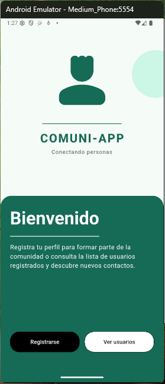
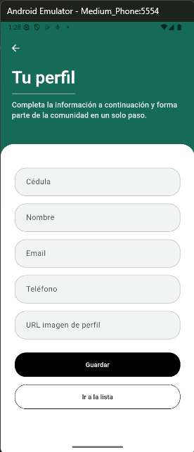
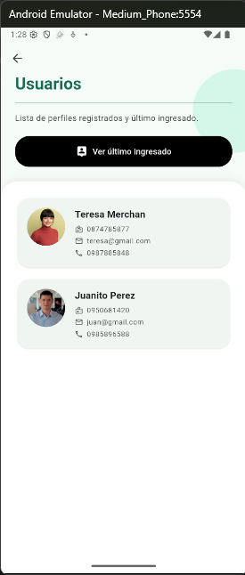

# mini_app_registro_perfil

Mini aplicación móvil para registrar datos básicos de un usuario y mostrar su perfil, con almacenamiento local en SQLite.

**Repositorio:** [Ver en GitHub](https://github.com/joaroca-spec/mini_app_registro_perfil)

---

## Descripción del proyecto

Aplicación Flutter que permite:

- **Registrar perfiles** con cédula, nombre, email, teléfono y URL de imagen de perfil.
- **Listar todos los usuarios** registrados en tarjetas con avatar e información.
- **Ver el último usuario ingresado** con un botón dedicado.
- Persistencia local con SQLite: los datos se mantienen al cerrar y reabrir la app.

Incluye pantalla de inicio (COMUNI-APP), formulario de registro con validación y modal de confirmación, y pantalla de lista con pull-to-refresh.

---

## Tecnologías utilizadas

- **Flutter** — Framework multiplataforma (Dart 3.x). Interfaz con Material Design 3.
- **go_router** — Navegación y rutas entre pantallas.
- **sqflite** — Base de datos SQLite en el dispositivo.
- **path_provider** — Obtiene la ruta donde se guarda la base de datos.

---

## SQLite en el proyecto

**SQLite** es una base de datos relacional embebida: no requiere servidor y se guarda en un archivo en el dispositivo.

En esta app:

- Se usa el paquete **sqflite** para acceder a SQLite desde Flutter.
- La base de datos se crea en el directorio de documentos de la aplicación (vía `path_provider`).
- Hay una tabla **usuarios** con: id, cedula, name, email, phone, avatar_url y created_at.
- Las operaciones son: **insertar** (al guardar un perfil) y **consultar** (listar todos y obtener el último registrado).

Los datos permanecen aunque se cierre la app hasta que se desinstale o se borren los datos de la aplicación.

---

## Instrucciones de instalación

### Requisitos

- [Flutter SDK](https://flutter.dev/docs/get-started/install) (estable, compatible con Dart 3.x)
- Android Studio / Xcode (para emulador o dispositivo)

### Pasos

1. **Clonar el repositorio**
   ```bash
   git clone https://github.com/joaroca-spec/mini_app_registro_perfil.git
   cd mini_app_registro_perfil
   ```

2. **Instalar dependencias**
   ```bash
   flutter pub get
   ```

3. **Ejecutar la aplicación**
   ```bash
   flutter run
   ```
   Selecciona un emulador o dispositivo conectado cuando Flutter lo pida.

Para compilar en release (APK en Android):
```bash
flutter build apk
```

---

## Capturas de pantalla

**Inicio (Home)**



**Registro de usuarios**



**Lista de usuarios**



---

## Estructura del proyecto

```
lib/
├── main.dart                 # Punto de entrada, tema y router
├── config/                   # Configuración global
│   ├── app_router.dart       # Rutas (go_router)
│   ├── app_theme.dart        # Tema de la app
│   └── database_config.dart  # Inicialización y ruta de SQLite
├── domain/                   # Modelo y lógica de datos
│   ├── user_model.dart       # Modelo de usuario
│   └── user_service.dart     # Alta y consultas (add, list, getUltimoRegistrado)
└── screens/
    ├── home_screen.dart      # Pantalla de inicio
    ├── registro_screen.dart # Formulario de registro
    ├── lista_usuarios_screen.dart  # Lista y “último ingresado”
    └── componentes/         # Widgets reutilizables
        ├── app_button.dart
        ├── app_input.dart
        ├── app_confirm_dialog.dart
        ├── app_user_card.dart   # Card + CircleAvatar por usuario
        └── componentes.dart     # Export de componentes
```

---
